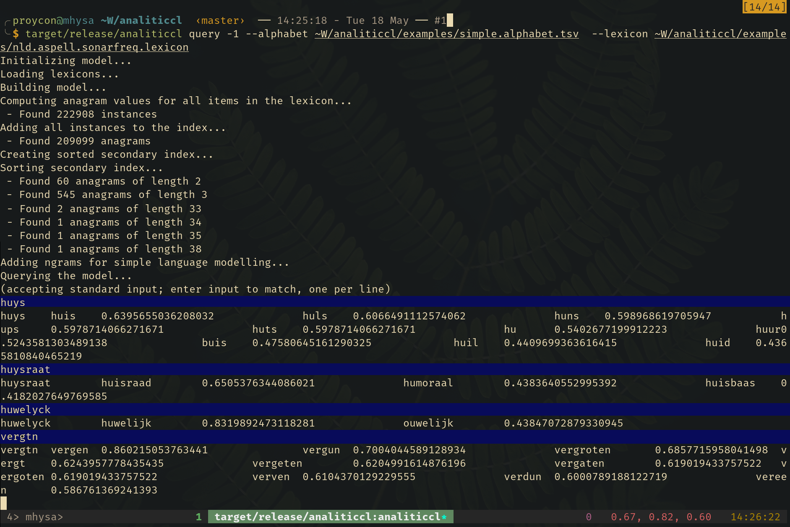

% Golden Agents: Analiticcl
%
% May 18th, 2021

## Entity Recognition in Golden Agents

**Goal:**

 * How can we detect names, locations, objects

**Problem:**

 * The HTR output contains all kinds of spelling variants
    - Due to HTR errors
    - Due to diachronical variation and simple lack of standardisation at the time
    - Due to arbitrary spacing or lack thereof
 * Normal out-of-the-box NER models won't work well
    - Due to the variantion
    - Due to the fact to have some very specific objects to recognize which existing NER models typically aren't trained on

## Stategy #6

**What do we have?**

* A fair amount of gazetteers/lexicons/thesauri containing the names, locations, objects we want to detect

**Approach**

* Use this information as the primary data source
* Match input data against these lexicons in a scalable way
    * we have hundreds of thousands of items in our lexicon
    * we have many documents to match

## Introducing Analiticcl

* A tool for variant matching for spelling correction and text normalisation.
* Reimplements (and attempts to improve upon) core ideas by Martin Reynaert as used in TICCL.

**Relationship with TICCL**

* Extracts core ideas, not an exact reimplementation by any means
* Why not ticcl?
    * High complexity, grown over many years, lots of experimental legacy
    * Lack of documentation
    * Many different submodules (ticcltools): hard to understand and operate
    * No proper test suite
    * No current maintainer for the underlying software
    * Taking a fresh persective sometimes helps

## Core Functionality

**Search space reduction**:

* Matching *n* input words against *m* lexicon items naively with e.g. Levensthein is prohibitively
  expensive: ``O(nm)``.
* Search space is drastically reduced by building an anagram index. This is a hashmap
  mapping **anagram values** to all actual words that use the exact same characters (i.e. are anagrams):
* Computing **anagram values**:
    1. Each character in the input alphabet is assigned a prime number in a sequence
    2. The product of these constitutes the anagram value
* Favourable properties for computation:
    * All factors are guaranteed subsets of the alphabet
    * Insertions are simple multiplications of anagram values: ``av(x) * av(y) = av(xy)``
    * Deletions are simple division of anagram values: ``av(xy) / av(x) = av(y)``
    * Checking whether one value occurs in the other is a simple modulo zero check: ``av(xy) % av(x) = 0``

## Core Functionality

**Distance Metrics:**

* The index enables us to reduce the full lexicon *m* to a much smaller list of instances to match against.
* For the reduced list of variants retrieved through the anagram index, we compute the follow metrics:
  - Damerau-Levenshtein
  - Longest common substring
  - Longest common prefix/suffix
  - Frequency information
  - Lexicon weight, usually binary (validated or not)
  - Casing difference (binary, different case or not)
* A score is computed that is an expression of a weighted linear combination of the above items (the actual weights are configurable)

## Query Mode

## Context and n-grams

* A word-by-word approach isn't sufficient
    * There may be tokenisation problems so the notion of word is vague
    * There may be splits and run-ons to resolve
* Correction vs Detection
    * Correction: *this input item is wrong, please correct it* (query mode)
    * Detection: *parts of the input item may or may not be wrong, find all errors* (search mode)
* **Search mode**:
    1. Given an input sequence, extract n-grams up to a certain order (for now simply 2)
    2. Pass all ngrams to query mode for variant lookup
    3. Find the top 250 or so sequence segmentations that maximise the variant scores (no context considered yet)
    4. Score these sequences with a simple language model
    5. Compute a weighted geometric mean between the language model score and variant model score, return the best sequence as result

## Search Mode

**Input:** *I tink you are rihgt*

## Other features

* **Frequency**: Lexicons may contain frequency information, this plays an important role in scoring variants. It is
    also a requirement for the search mode.
* **Confusable rules**: Lists of rules can be provided that either promote or penalise certain substitutions when
    scoring. Example: ``uy->ui``, ``yck$->ijk$``.
* **Variant lists**: Explicit variant/error lists (weighted or not) can be an extra source of input (e.g. Martin Reynaerts's TICCLAT).

## Implementation

* Implemented in Rust for high-performance (compiles to native machine code)
* Multithreaded, maximally leverage all available cores while searching
* Single command-line tool
* *ToDo later:* Simple Python binding

## ToDo

* Python binding
* **Iterative chaining:** gradually expand a variant list in multiple iterations over the input data. Bridges larger edit
    distances. Again inspired on Martin Reynaert's approach in TICCL.
* **Key phrases**: Reimplement the main ideas from Marijn Koolen's *fuzzy search* tool to look for a limited set of key phrases: *Variant matches contextualize and strengthen eachother*.
* Tweaking the weights
* Evaluation

## Evaluation

* Proper evaluation on gold standard data?
* Comparison with TICCL?

**What do we have?**:

* Initial test on a lexicon extracted from golden agents HTR data
* Test suite (unit tests, integration tests)
* Initial documentation + API reference
* Benchmarks for performance measurements

## Application to Golden Agents: Initial experiment

* I first derived a lexicon of all words in the HTR data of our collection. Note that this is based on a very rough
    extraction from the Page XML and a very rough tokenisation, with total disregard for the actual document structure.
* I did the same for the ground truth portion of the data.
* I extracted some reference lexicons for first names, surnames and street names from the Linked Data collections described in resources/.
* I matched all types in the HTR-derived lexicon against several reference lexicons.

Conclusions:

* matching strategy works well and scales
* the quality is very dependent on the quality of the reference lexicons and the weights assigned to the different metrics

## Application to Golden Agents: General idea

1. We need to extract useful lexicons for names, locations, objects, as well as a generic background lexicon and
   language model.
    * Leon has collected sources, I have already extracted some rough data from them for testing.
2. Specific tools are required to parse the Page XML and extract certain logical units
    * Bram Buitendijk is working on this now
3. The text of these logical units could subsequently be passed to analiticcl for variant-aware entity detection
    * Analiticcl is a very generic tool, the output greatly depends on quality of input lexicons, it attempts to match
      entities directly.
    * The specific tools need not worry about the variant-problem
4. Specific tools can also make use of certain layout cues to help identify certain entities
5. We can make use of key formulaic phrases to find context cues for certain entities. (strategy #5), either with Marijn's fuzzy-search or in the future also with analiticcl.
    * Formulaic phrases will need to be identified by experts (Harm?)

## References

* **Analiticcl**: https://github.com/proycon/analiticcl
* **Golden Agents HTR Repo:** https://github.com/knaw-huc/golden-agents-htr
* **sesdiff:** https://github.com/proycon/sesdiff
* **ticcltools:** https://github.com/LanguageMachines/ticcltools

**Publications**:

* Reynaert, Martin. (2004) Text induced spelling correction. In: Proceedings COLING 2004, Geneva (2004). https://doi.org/10.3115/1220355.1220475
* Reynaert, Martin. (2011) Character confusion versus focus word-based correction of spelling and OCR variants in corpora. IJDAR 14, 173–187 (2011). https://doi.org/10.1007/s10032-010-0133-5

