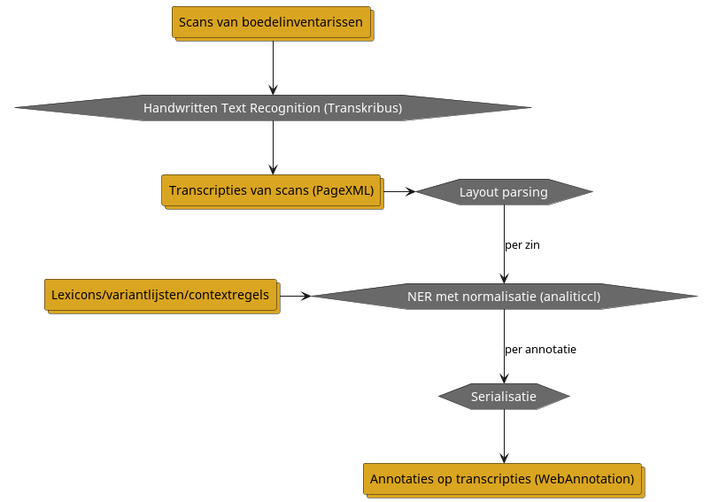
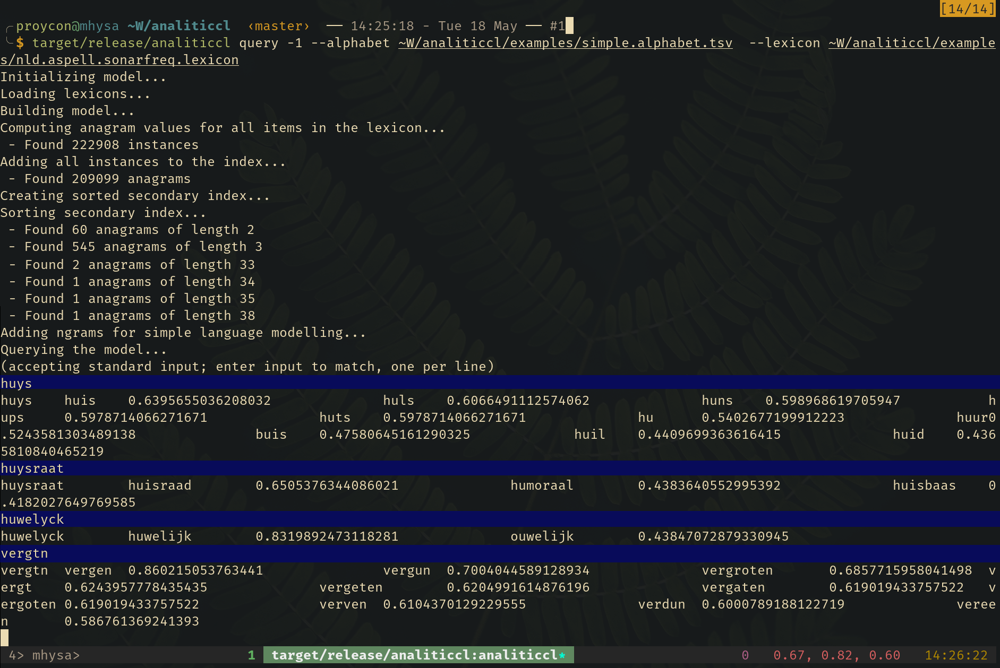
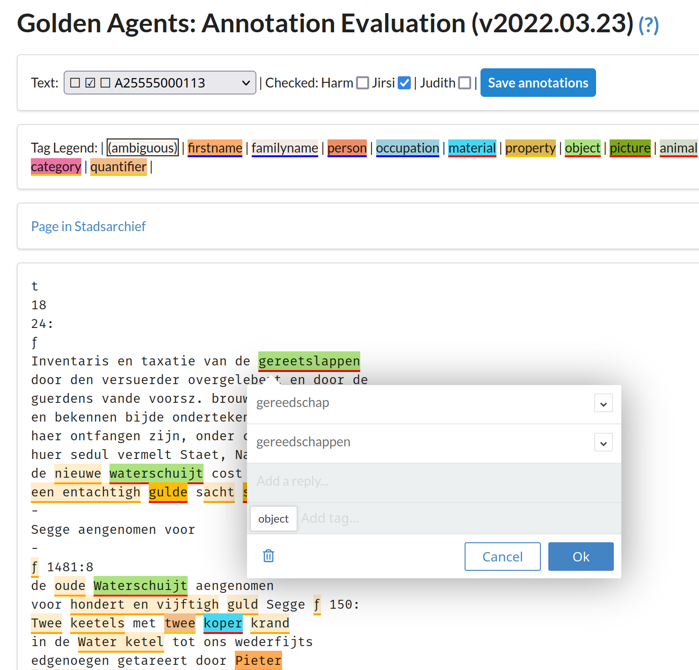
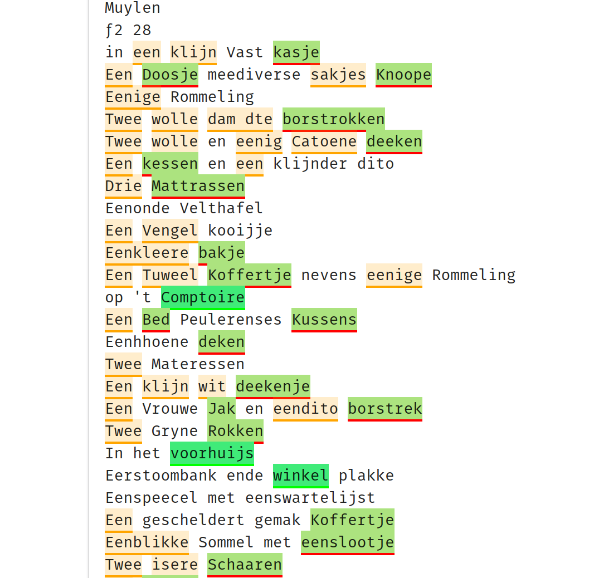

% Golden Agents: Detectie van entiteiten in boedelinventarissen
% Maarten van Gompel, Bram Buitendijk, Leon van Wissen, Harm Nijboer, Menzo Windhouwer
% 23 juni 2022 

## Introductie

* Boedelinventarissen beschrijven de huisraad, activa en passiva.
    * geen onroerend goed
    * nav huwelijk, faillisement, nalatenschap etc...
* Deze willen we makkelijker ontsluiten voor onderzoekers
    * lange onderzoekstraditie (archeologisch, sociaal-historisch, etc..)

 **Onze doelstelling**: Hoe kunnen we *automatisch* namen van personen, locaties, en vooral objecten herkennen in boedelinventarissen?

## Dataverwerkingspipeline (1)

## Uitdagingen

 * De HTR output bevat allerlei spellingsvariatie:
    - door HTR-fouten
    - door diachronische spellingsvariatie en gebrek aan standaardisatie indertijd door spatiëringsfouten (splits/run-ons)
* Normale entiteitherkenning werkt hierdoor niet goed
    - Standaard NER-modellen zijn niet getraind op objecten

## Onze strategie

**Wat hebben we?**

* Een flink aantal lexicons/thesauri met namen van personen, locaties en objecten (diverse bronnen)
* Met name de objecten hebben we handmatig verrijkt
* INT Historisch Lexicon; gecureerde lijst die historische varianten koppelt, tevens geschikt als *achtergrondlexicon*

**Aanpak**

* We doorzoeken boedelinventarissen op termen uit deze lexicons, rekening houdend met:
    * spellingsvariatie; zoek de begrippen in de lexicons die het meeste op de aangetroffen vorm lijken
* combinatie van named entity recognition en tekstnormalisatie in één

## Dataverwerkingspipeline (2)

## Analiticcl

* Software voor spellingscorrectie en tekstnormalisatie
    * koppelt woorden en frasen aan varianten
    * leest en genereert *variantenlijsten*
    * doet zowel *correctie* als *detectie*
    * verschillende afstandsmetrieken (waaronder Damerau-Levenshtein)
    * *schaalbaarheid:* gaat efficiënt om met grote zoekruimten en zoekafstanden
    * lexicons kunnen *frequentieinformatie* bevatten
    * *context*: weegt contextinformatie mee d.m.v. taalmodellen of opgestelde contextregels
    * deze contextregels maken een soort tagging mogelijk
    * *command-line tool* en *library*: geïmplementeerd in Rust, met Python bindings
* Herimplementeert en bouwt voort op kernideeën van Martin Reynaert  (TICCL)
* Technisch-inhoudelijke presentatie: [https://diode.zone/w/kkrqA4MocGwxyC3s68Zsq7](Analiticcl: efficient fuzzy string matching for spelling/post-OCR correction)

## Voorbeeld Analiticcl

## Lexiconcuratie

* Kwaliteit is erg afhankelijk van de kwaliteit van de input (lexicons, variantlijsten)
* Handmatige **lexiconcuratie** om tot een lijst 'boedeltermen' te komen. Focus op objecten, maar ook categorieën die helpen deze vindbaar te maken (denk aan materialen, telwoorden en andere eigenschappen).
    * ``https://github.com/knaw-huc/golden-agents-htr/blob/master/resources/boedeltermen.csv``
* Belangrijke rol voor het achtergrondlexicon (INT Historisch Lexicon)

## Referentiedata en annotatie

Om te kunnen evalueren hebben we referentiedata nodig.

* Een klein aantal boedelinventarissen zijn handmatig geannoteerd, zowel op categorie (persoon, locatie, object) als op tekstnormalisatie
* Een annotatieomgeving (gebaseerd op Recogito-JS) is speciaal hiervoor ontwikkeld:
    * Source: ``https://github.com/knaw-huc/golden-agents-htr/tree/master/analiticcl-evaluation-tool/``
* Annotatoren hebben een eerste output van analiticcl gecorrigeerd en aangevuld om tot een ground-truth the komen
    * dank ook aan Jirsi Reinders & Judith Brouwer
* Op deze development-set hebben we verdere parameters getest en input lexicons verbeterd
* Een evaluatietool vergelijkt systeemoutput (analiticcl) met de referentiedata en berekent Precisie, Recall en F1.

## Voorbeeld Annotatietool

## Voorbeeld resultaten

## Evaluatie

**Classificatie & Normalisatie**

Metriek    | #out | #ref | Precisie | Recall | F1    
-----------|------|------|----------|--------|---------
Objecten   | 448  | 584  | 0.498    | 0.382  | 0.432
Personen   | 219  | 130  | 0.612    | 0.638  | 0.625
Locaties   |  14  |  26  | 0.143    | 0.077  | 0.100
Vertrekken |  33  |  33  | 0.455    | 0.455  | 0.455
**Totaal** |  -   |  -   | 0.525    | 0.435  | 0.475 

**Alleen Classificatie**

Metriek    | Precisie | Recall | F1    
-----------|----------|--------|---
Objecten   | 0.681    | 0.522  | 0.432
Personen   | 0.685    | 0.714  | 0.699
Locaties   | 0.214    | 0.115  | 0.150
Vertrekken | 0.455    | 0.455  | 0.455
**Totaal** | 0.662    | 0.550  | 0.601 

## Referenties

* **Analiticcl**: https://github.com/proycon/analiticcl
* **Golden Agents HTR Repo:** https://github.com/knaw-huc/golden-agents-htr

**Publicaties**:

* Reynaert, Martin. (2004) Text induced spelling correction. In: Proceedings COLING 2004, Geneva (2004). https://doi.org/10.3115/1220355.1220475
* Reynaert, Martin. (2011) Character confusion versus focus word-based correction of spelling and OCR variants in corpora. IJDAR 14, 173–187 (2011). https://doi.org/10.1007/s10032-010-0133-5

